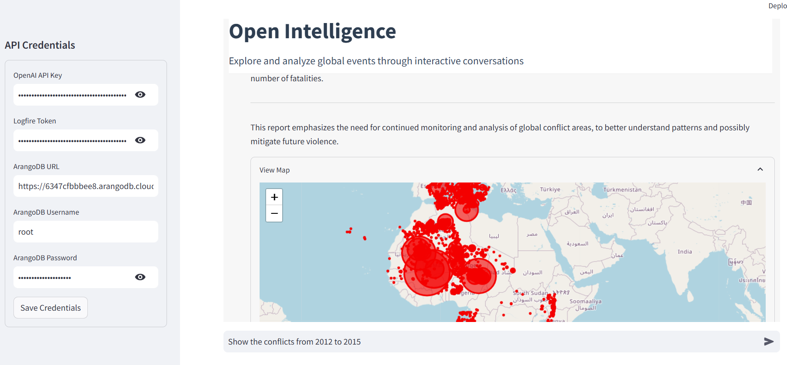

# Open Intelligence



## Overview

Open Intelligence is an interactive data analysis platform that allows users to explore global events through natural language queries. The platform connects to a graph database of global events and provides visual insights through maps, charts, and comprehensive reports.

## Features

- **Conversational Interface**: Ask questions about global events in natural language
- **Interactive Maps**: Visualize events geographically with interactive folium maps
- **Data Analysis**: Automatically analyze trends and patterns in conflict data
- **Report Generation**: Create comprehensive markdown reports summarizing findings
- **Query Caching**: Save previous analyses for quick reference

## Installation

1. Clone the repository:
```bash
git clone https://github.com/yourusername/open_intelligence.git
cd open_intelligence
```

2. Install the required dependencies:
```bash
pip install -r requirements.txt
```

3. Set up your environment variables:
Create a `.env` file with the following contents:
```
OPENAI_API_KEY=your_openai_api_key
ARANGODB_URL=your_arangodb_url
ARANGODB_USERNAME=your_arango_username
ARANGODB_PASSWORD=your_arango_password
```

## Usage

1. Start the application:
```bash
streamlit run app_ui.py
```

2. Open your browser and navigate to `http://localhost:8501`

3. Begin by asking a question in the chat interface, such as:
   - "Show me conflict events in the Middle East in 2020"
   - "What are the top actor groups involved in conflicts in Africa?"
   - "Map the events with the most fatalities in Europe"
   - "Compare conflict trends in Asia between 2018 and 2022"

## Architecture

The Open Intelligence platform consists of the following components:

- **Streamlit UI**: A clean, professional chat interface for user interaction
- **Agent Module**: An AI-powered agent that processes user queries
- **Graph Database**: ArangoDB instance storing global event data
- **Data Visualization**: Dynamic visualization tools for maps and charts

## Example Queries

- **Regional Analysis**: "Show me conflicts in Eastern Europe in 2022"
- **Actor Analysis**: "Which groups were most active in Syria?"
- **Temporal Analysis**: "Compare conflict patterns before and after COVID-19"
- **Geospatial Analysis**: "Show me a heatmap of events near border regions"
